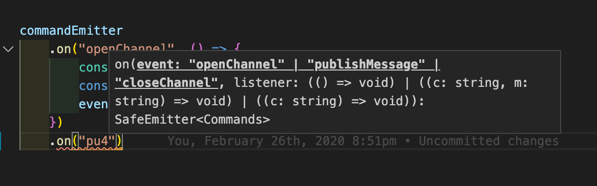
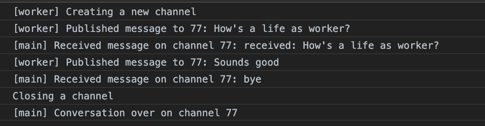

# typescript-webpack-web-worker-example

Working example of type-safe web worker event handling using typescript

This repository contains a fully working example of typescript type-safe way of defining commands and events exchanged between main thread and worker thread.



As shown in the screenshot above, you can get the benefits of type-safe coding for web workers!

## Architecture

The main thread runs `index.ts` while the worker runs `worker/worker.ts`. The commands and events they exchange and emitters are defined in `event.ts` and this file is imported to both the main thread script and the worker thread script.

Since `index.ts` and `worker/worker.ts` needs to have a different `lib` option for TypeScript compiler, I have separated the directory.

The build is actually performed by webpack and it can output both the main and the worker in the same build.

## Setup

Clone this repository, then

```shellscript
% yarn
% yarn build
% open index.html
```

Open your browser console, and you will see the conversation of main and worker ;)



## LICENSE

MIT.
